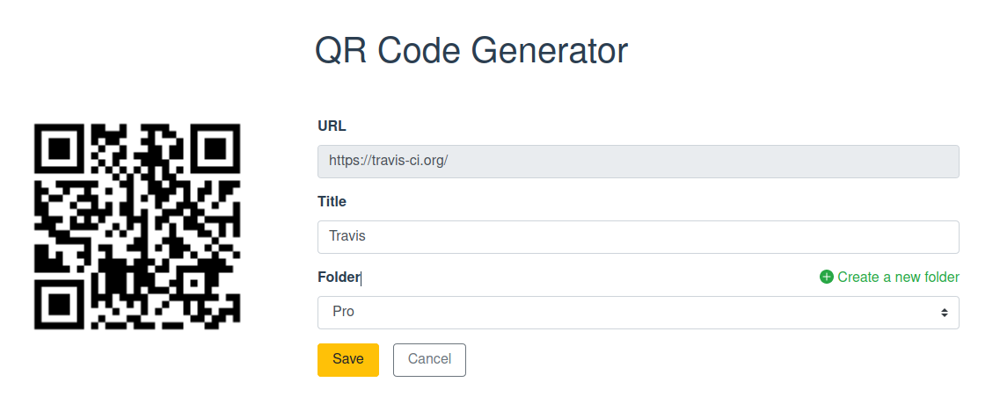

# QR Code Generator

VueJS & Bootstrap Project

Generates QR Codes from URLs, and allow users to give them a title and save them.

View project live here : https://alarid.github.io/QR-Code-Generator/





<hr>

## Project setup
```
npm install
```

### Compiles and hot-reloads for development
```
npm run serve
```

### Compiles and minifies for production
```
npm run build
```

### Run your unit tests
```
npm run test:unit
```

### Lints and fixes files
```
npm run lint
```

## Licence


This work is licensed under a [Creative Commons Attribution-NonCommercial-ShareAlike 4.0 International License](https://creativecommons.org/licenses/by-nc-sa/4.0/).
